# 🛡️ LifeGuardian+


---
<p>
  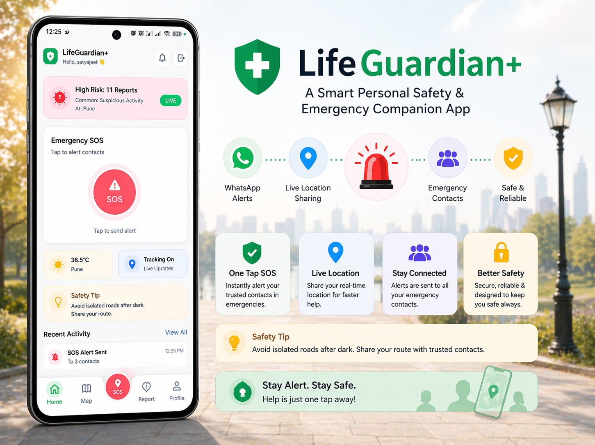
</p>

## 🚀 A Smart Personal Safety & Emergency Companion App

LifeGuardian+ is a **real-time safety platform** designed to provide instant emergency response, intelligent tracking, and community-based safety awareness.

It combines **live tracking, SOS alerts, incident reporting, and real-time data systems** into a single unified application.

---

# ✨ Complete Feature Set

## 🚨 Emergency & SOS System

* One-tap SOS trigger
* Sends real-time alerts to emergency contacts
* WhatsApp alerts using Twilio (via Spring Boot backend)
* Includes user name + live location link
* Automatic activation of live tracking

---

## 📍 Live Location Tracking

* Continuous real-time tracking using Firebase Realtime Database
* High-accuracy GPS tracking (Geolocator)
* Start/Stop tracking functionality
* Role-based tracking (victim/responder)
* Timestamp-based updates

---

## 🗺️ Smart Map System (Mapbox)

* Live user location display
* Heatmap visualization of danger zones
* Radius-based filtering of incidents
* Recenter functionality
* Interactive map UI

---

## 🚔 Crime & Incident Reporting

* Report incidents with:

    * 📍 Location (map picker / search)
    * 🖼️ Image upload (Cloudinary/Firebase)
    * 📝 Description
* Stored in Firestore
* Visible to other users (community awareness)

---

## 🔥 Heatmap & Safety Visualization

* Toggleable heatmap view
* Displays high-risk zones
* Helps users avoid unsafe areas
* Based on real user-reported data

---

## 👥 Emergency Contact System

* Add emergency contacts
* Store contacts in Firestore
* QR-based contact verification
* WhatsApp verification flow
* Delete/manage contacts

---

## 🔐 Authentication System

* Firebase Email/Password login
* Google Sign-In integration
* Persistent login (AuthState stream)
* Secure session handling

---

## 🧑‍💼 User Profile & Settings

* Edit profile (name, image)
* Upload profile image (Firebase Storage)
* Change password
* Privacy policy screen
* Settings management

---

## 🧭 Navigation System

* Bottom navigation architecture
* Multi-screen routing
* Smooth UI transitions

---

## 📡 Backend Integration

### Firebase (Main Backend)

* Firestore → user data, reports, contacts
* Realtime DB → live tracking
* Firebase Auth → authentication
* Firebase Storage → images

### Spring Boot Backend (SOS Module)

* Secure REST API
* Handles SOS requests
* Integrates Twilio WhatsApp API
* Keeps sensitive credentials hidden

---

## 📲 Additional Features

* Location permission handling
* Background-safe tracking logic
* Error handling & validation
* Responsive UI (Material Design)

---

# 🏗️ System Architecture

### System Architecture Design
<p>
  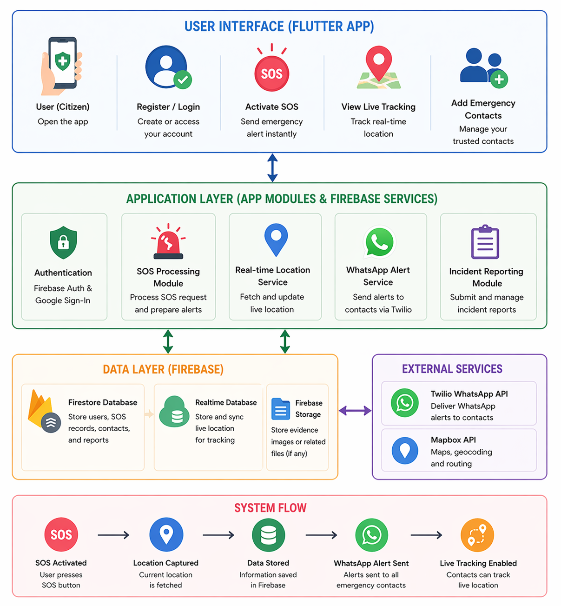
</p>

```id="fullarch"
Flutter App
   ↓
Firebase (Auth + Firestore + Realtime DB + Storage)
   ↓
Spring Boot Backend (SOS API)
   ↓
Twilio WhatsApp API
```

---

# 🔄 Application Flow

1. User logs in
2. Adds emergency contacts
3. Enables tracking
4. Presses SOS
5. Location captured
6. Data stored in Firebase
7. Request sent to backend
8. WhatsApp alerts triggered
9. Contacts track live location

---

# 🛠️ Tech Stack

| Category       | Technology              |
| -------------- | ----------------------- |
| Frontend       | Flutter                 |
| Backend (Core) | Firebase                |
| Backend (SOS)  | Spring Boot             |
| Maps           | Mapbox                  |
| Messaging      | Twilio                  |
| Database       | Firestore + Realtime DB |
| Storage        | Firebase Storage        |

---

## 📸 App Screenshots

### 🚀 App Launch (Splash Screen)
<p>
  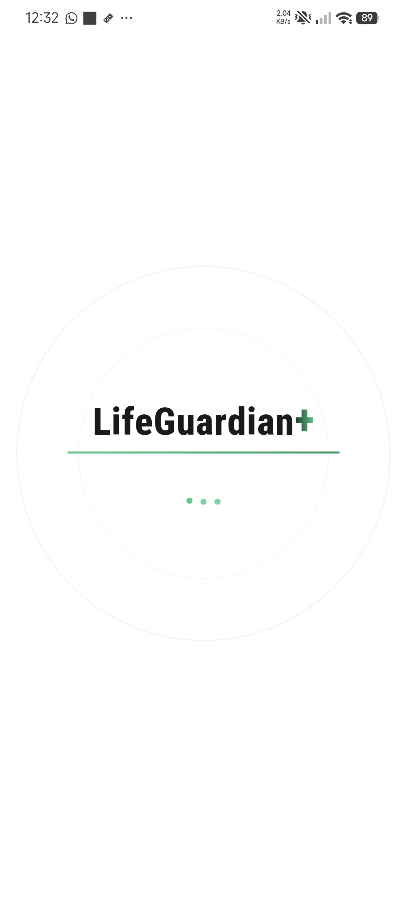
</p>

### 🔐 Authentication
<p>
  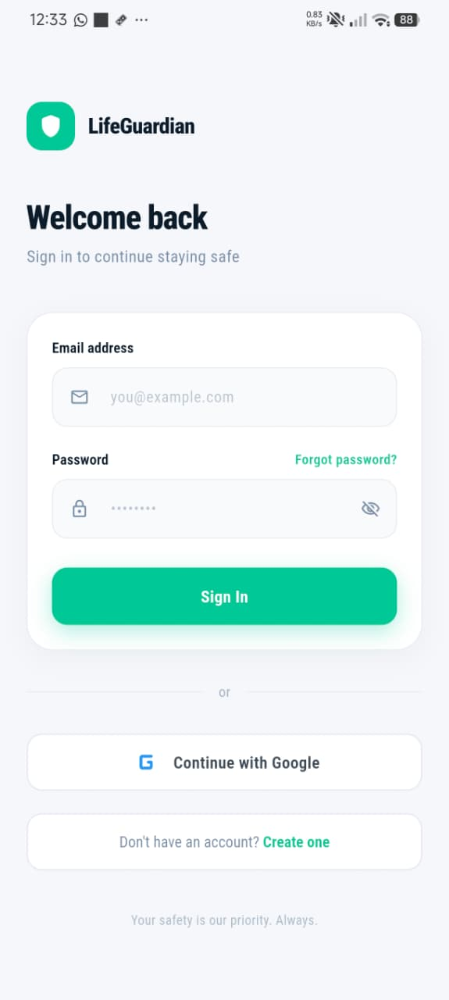
</p>

### 🏠 Home Dashboard
<p>
  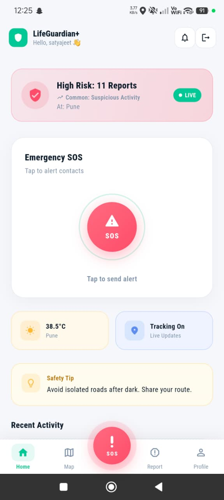
</p>

### Live Map
<p>
  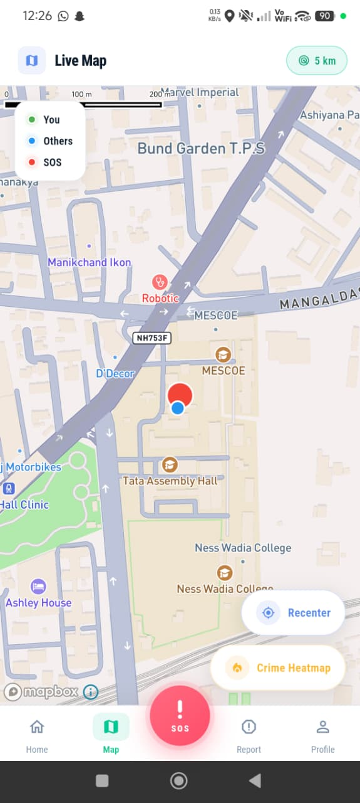
</p>

### Heatmap
<p>
  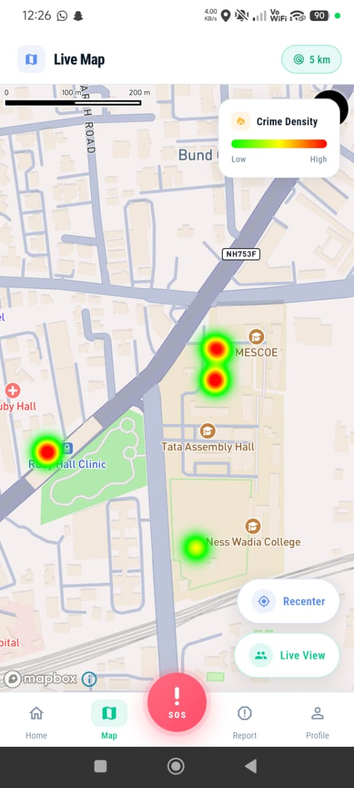
</p>

### 🚨 Emergency SOS
<p>
  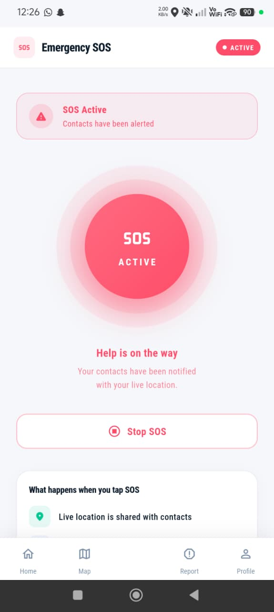
</p>

### 🚔 Report Incident
<p>
  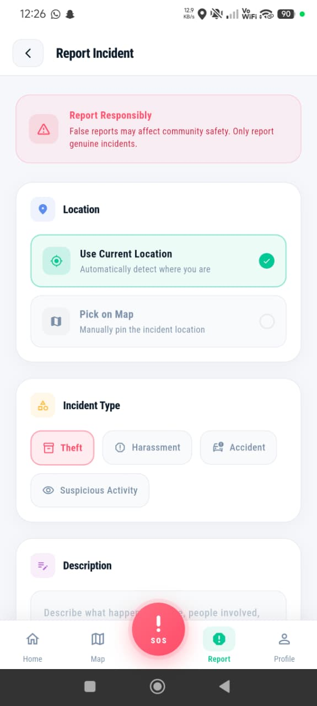
</p>

### 👤 User Profile & Contacts
<p>
  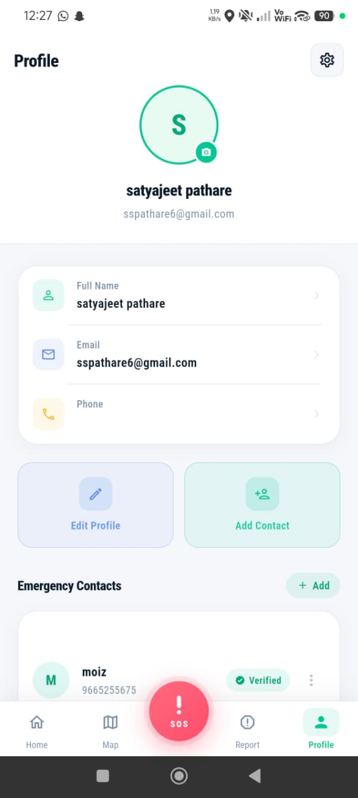
</p>

### ✅ Contact Verification (QR)
<p>
  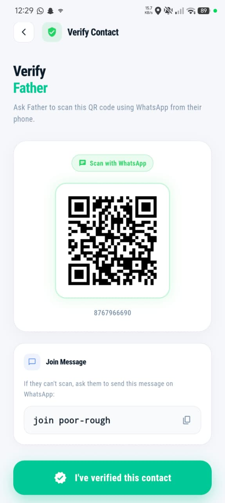
</p>

---

# 🔐 Security

* Twilio API keys secured in backend
* No sensitive keys exposed in frontend
* Firebase security rules enforced
* Token-based architecture

---

# 🚀 Getting Started

```id="startcmd"
flutter pub get
flutter run
```

---

# 📌 Future Enhancements

* 🤖 AI-based danger prediction
* 🚓 Police/emergency integration
* 🔔 Push notifications
* 🌍 Offline emergency mode
* 📊 Analytics dashboard

---

# 👨‍💻 Author

**Moiz Shaikh**

---

# ⭐ Support

If you found this useful, give it a ⭐ on GitHub!
